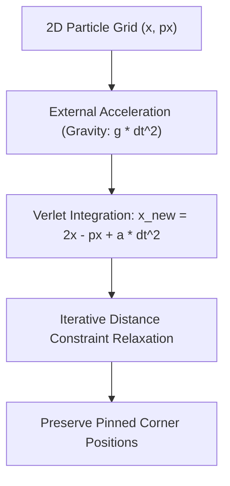

# genpark-verlet-cloth-spring-mass-simulation-skill

Agent Skill implementing **Position-Based Verlet Integration Cloth Dynamics** with structural distance constraints and pinned boundary conditions.

## Architectural Overview

